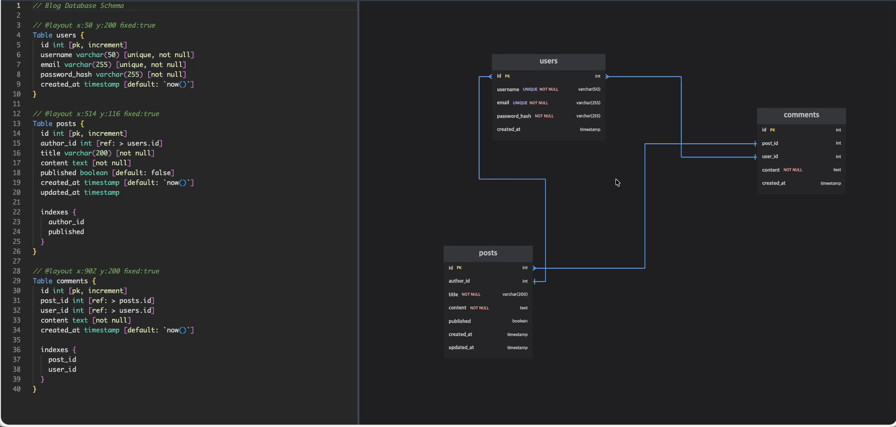
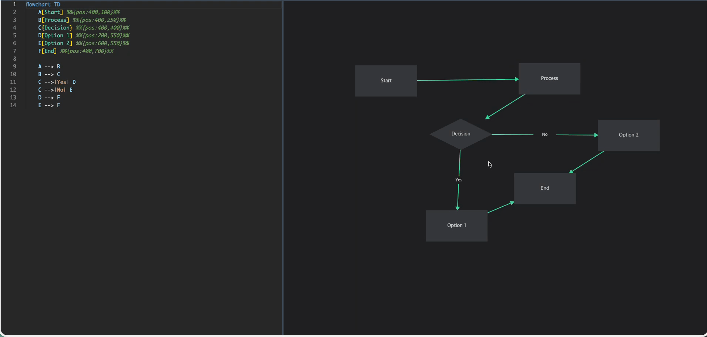

# 📍 DiagramPin

> **Pin Your Diagram Layouts in Code**

A powerful diagram editor that supports DBML and Mermaid with automatic position locking. Create, edit, and maintain diagram layouts that stay consistent in your codebase.

---

## 🌐 Live Demo

**👉 Try it now: [https://diagrampin.com](https://diagrampin.com)**

Experience the power of position-locked diagrams directly in your browser!

---

## 💡 핵심 컨셉

> **"코드로 위치까지 관리하세요!"**
>
> 테이블을 드래그하면 `@layout` 주석이 자동 업데이트됩니다.
> Git으로 다이어그램 레이아웃까지 버전 관리하세요!

---

## 🎬 Demo

| DBML Editor | Mermaid Editor |
|:-----------:|:--------------:|
|  |  |
| 테이블 드래그 → `@layout` 자동 업데이트 | ER 다이어그램 위치 조정 |

---

## ✨ Features

### 📌 Position Locking
- Lock node positions directly in your code using `@layout` annotations
- Positions persist across code changes and team collaboration
- Never lose your carefully arranged diagram layout again

### 🗃️ DBML Support
- Full Database Markup Language support
- Visualize database schemas as Entity-Relationship Diagrams
- Perfect for database design and documentation

### 🔄 Mermaid Support
- Flowcharts, sequence diagrams, ER diagrams, and more
- Complete Mermaid syntax support
- Ideal for system architecture and process flows

### ⚡ Auto Save
- Automatic layout persistence
- No manual save required
- Seamless editing experience

### 🎨 Intuitive Interface
- Clean, modern UI
- Drag-and-drop positioning
- Real-time preview

---

## 🚀 Use Cases

### Database Schema Design
Design your database schema with DBML, visualize it as an ERD, and lock table positions for consistent documentation across your team.

```dbml
Table users {
  id integer [primary key]
  username varchar
  email varchar
}

Table posts {
  id integer [primary key]
  user_id integer [ref: > users.id]
  title varchar
  content text
}

@layout {
  users: { x: 100, y: 100 }
  posts: { x: 400, y: 100 }
}
```

### System Architecture
Create system diagrams with Mermaid and maintain layout consistency across iterations.

```text
flowchart LR
    A[Client] --> B[Load Balancer]
    B --> C[Server 1]
    B --> D[Server 2]
    C --> E[Database]
    D --> E

@layout {
  A: { x: 50, y: 200 }
  B: { x: 250, y: 200 }
  C: { x: 450, y: 150 }
  D: { x: 450, y: 250 }
  E: { x: 650, y: 200 }
}
```

### Technical Documentation
Keep your documentation diagrams clean and consistent with locked layouts.

---

## 💡 Why DiagramPin?

Most diagram tools don't preserve your carefully arranged layouts when you update the code. DiagramPin solves this by:

- ✅ Storing positions directly in your code
- ✅ Maintaining layouts across code changes
- ✅ Enabling team collaboration with consistent diagrams
- ✅ Supporting version control for both content and layout

---

## 🛠️ Supported Formats

| Format | Description | Use Cases |
|--------|-------------|-----------|
| **DBML** | Database Markup Language | Database schema design, ERD creation |
| **Mermaid** | Diagram as Code | Flowcharts, sequence diagrams, system architecture |

---

## ⚠️ 안내

> 이 저장소는 **프로젝트 정보 및 이슈 추적용**으로만 사용됩니다.
> 실제 소스 코드는 private repository에서 관리됩니다.

버그 리포트, 기능 요청, 피드백은 환영합니다!

👉 **[GitHub Issues에서 이슈 등록하기](https://github.com/DiagramPin/diagrampin/issues)**

---

## 📄 License

DiagramPin is a proprietary software. This repository is for community engagement and issue tracking only.

---

<div align="center">

**Made with ❤️ for developers who love clean diagrams**

[Try DiagramPin Now](https://diagrampin.com) | [Report Issue](https://github.com/DiagramPin/diagrampin/issues/new)

</div>
