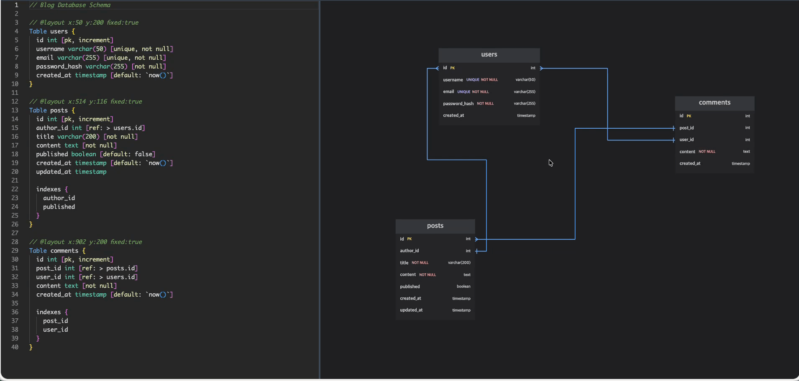
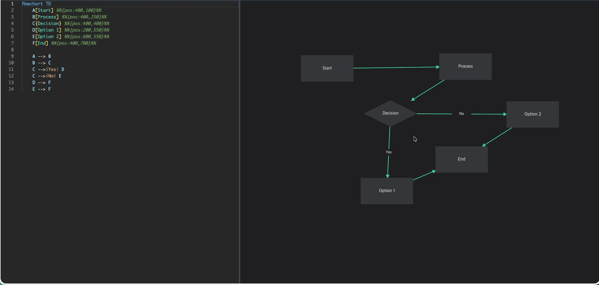

# 📍 DiagramPin

**Just drag nodes where you want them!**

Layouts automatically sync to your code. Version control ready.

**🌐 Try it now: [diagrampin.com](https://diagrampin.com)**

---

## What this repository is

This repository is the **public-facing home** for DiagramPin:

- **README + docs** for understanding the product quickly
- **Issue templates** for feedback and bug reports
- **Demo assets** (GIFs, screenshots)

> ⚠️ The **production app is hosted** at **diagrampin.com**.
> This repo does not contain the full application workspace.
> The public CLI is available via npm, and the integration workspace is maintained separately.

---

## 🎬 Demo

| DBML | Mermaid |
|:-:|:-:|
|  |  |

Drag nodes → `@layout` auto-updates in your code!

---

## ✨ Features

- Drag nodes → positions auto-save to code
- Bidirectional sync between code and diagram
- Version control your layouts with Git
- Works with DBML and Mermaid

### Supported Formats

| Format | Type | Use Cases |
|--------|------|-----------|
| **DBML** | Database Markup | ERD, Schema Design |
| **Mermaid** | Diagram as Code | Flowcharts, ER, Sequence |

---

## How DiagramPin works (conceptual)

DiagramPin keeps **layout coordinates in version control** so your diagram stays consistent across machines and teammates.

High-level flow:

1. Parse DBML / Mermaid
2. Render nodes + edges
3. Save coordinates back to code (`@layout`) or a sidecar state file
4. Commit to Git

This makes layout changes visible in code reviews and reproducible across environments.

---

## Quick Start (Hosted App)

If you just want to use DiagramPin right now:

1. Go to **[diagrampin.com](https://diagrampin.com)**
2. Upload or paste your DBML / Mermaid
3. Drag nodes to rearrange
4. Download or copy the updated file with `@layout`
5. Commit to Git

---

## CLI Quick Start (Public)

Install the CLI:

```bash
npm install -g diagrampin
```

Quick usage:

```bash
diagrampin analyze schema.dbml
diagrampin layout plan schema.dbml --strategy group-aware
diagrampin layout apply schema.dbml
diagrampin layout export-inline schema.dbml
```

### Agent-friendly automation

- JSON output is the default contract (`ok`, `schemaVersion`, `command`, `data`)
- `plan` vs `apply` keeps dry-run safe for automation
- Built-in checkpoints + undo
- stdin supported with `-`

---

## Developer Workflow (Integration Workspace)

> This section applies **only if you have access to the integration workspace** where the full source lives.

### Core idea

- **Layout source of truth** is a sidecar JSON file (`*.diagrampin.json`)
- Inline `@layout` is supported for compatibility
- **CLI-only automation** is the official workflow (no MCP in production)

### Layout source order

```
sidecar > inline @layout > auto-layout
```

### Workspace CLI entrypoint

```bash
npx tsx scripts/cli-agent.ts <command>
```

### Typical CLI flow

```
analyze -> group plan -> layout plan -> layout validate -> layout apply -> export-inline -> checkpoints -> undo
```

### Example commands

```bash
npx tsx scripts/cli-agent.ts analyze <schema.dbml>
npx tsx scripts/cli-agent.ts layout plan <schema.dbml> --strategy group-aware
npx tsx scripts/cli-agent.ts layout apply <schema.dbml>
npx tsx scripts/cli-agent.ts layout export-inline <schema.dbml>
```

---

## Local Development (Integration Workspace)

> Not available in this public repository.
> If you have access to the integration workspace, the typical flow is:

```bash
cd frontend/apps/diagrampin
npm install
npm run dev
```

### Build & Test (Integration Workspace)

```bash
npm run test
npm run typecheck
npm run lint
npm run build
```

---

## Repository Contents (Public)

```
.
├── README.md
├── CONTRIBUTING.md
├── docs/
│   └── screenshots/
└── .github/
    └── ISSUE_TEMPLATE/
```

---

## 💬 Feedback

We'd love to hear from you!

Whether it's a **new feature request**, **improvement idea**, or **bug report** — all feedback is welcome.

👉 **[Submit your feedback here!](https://github.com/DiagramPin/diagrampin/issues)**

---

## Contributing

See [CONTRIBUTING.md](CONTRIBUTING.md) for contribution guidelines.
